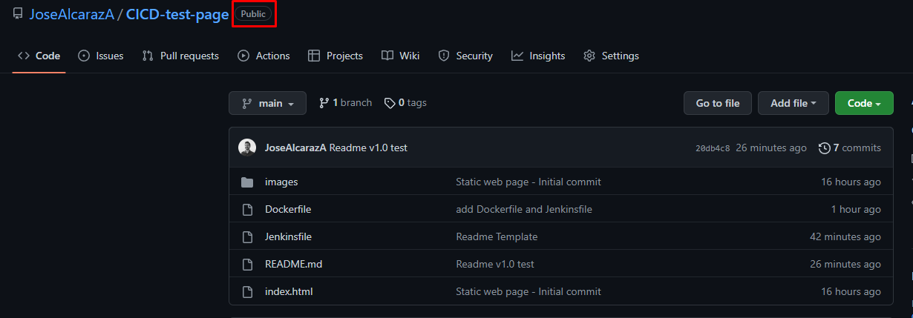

# DevOps Crush Course

## CI/CD Laboratory by Jose Alcaraz


## Proceso de implementación:

Inicialmente para llevar a cabo el laboratorio de **CI/CD** se realizo la creación de un proyecto de código sencillo para la implementación de un sitio web estático. Dicho proyecto se alojó sobre un repositorio de código en [GitHub](https://github.com/JoseAlcarazA/CICD-test-page). Para efectos del laboratorio el repositorio de código se creó con accesibilidad publica para facilitar la descarga del código desde el nodo de trabajo de Jenkins.



El proyecto de código consístete de un archivo Dockerfile usado para la construcción de la imagen de nginx que se encargará de desplegar la página web estatica:

```docker
FROM nginx:alpine

LABEL maintainer="alcaraza.jose@gmail.com"

COPY index.html /usr/share/nginx/html/
COPY images /usr/share/nginx/html/images

EXPOSE 80

CMD [ "nginx", "-g", "daemon off;" ]
```

El proyecto también posee un archivo Jenkinsfile que contiene las instrucciones que usará el pipeline de Jenkins para en primera instancia crear la imagen de Docker y finalmente almacenarla sobre un repositorio en [DockerHub](https://hub.docker.com/repository/docker/dockerjosealcaraz/cicd-crash-course)

```json
pipeline {
    agent { label "newslave" }
    stages {
        stage("Build") {
            steps{
                sh 'docker build -t dockerjosealcaraz/cicd-crash-course:latest .'
            }
        }
        stage("Publish") {
            steps{
                withDockerRegistry([credentialsId: "docker-hub", url: ""]) {
                    sh 'docker push dockerjosealcaraz/cicd-crash-course:latest'
                }
            }
        }
    }
}
```

Y finalmente el proyecto de código posee un archivo index y los recursos multimedia para el sitio web.

Después de la implementación de implementar el proyecto de código se procedió con la creación del servicio Jenkins. El servicio jenkins se desplegó haciendo uso de infraestructura sobre contenedores usando como base la imagen oficial de [Jenkins](https://hub.docker.com/r/jenkins/jenkins) y mediante un documento de docker-compose:

```yaml
version: '3'
services:
  jenkins:
    container_name: jenkins
    image: jenkins/jenkins
    ports:
      - "8080:8080"
      - "50000:50000"
    volumes:
      - jenkins_home:/var/jenkins/home
    restart: always

volumes:
  jenkins_home:
```


Una vez ejecutado el contendor de Jenkins, y validando que se encuentre operativo, se procede con el acceso al sitio haciendo uso del la dirección http://localhost:8080:


Al ingresar a Jenkins por primera vez se mostrará una ventana que solicita la contraseña de administrador para proceder con la configuración de la administración:


Luego de ingresar la contraseña que se encuentra en la ruta dentro del contenedor /var/jenkins/secrets/initialAdminPassword, se procede con la creación de un usuario para el uso de la herramienta y se instalan los plugins recomendados:


Una vez la herramienta ya se encuentra lista para usarse, se procede con la configuración, en este caso se decidió por orden crear inicialmente un directorio en el que se almacenarían todos los elementos pertenecientes al laboratorio:


También se realizó la instalación del plugin **[Docker Pipeline](https://plugins.jenkins.io/docker-workflow) que permitirá la ejecución de comando Docker desde el pipeline y finalmente se realizó la creación de nodo de trabajo para que Jenkins lo usará para la ejecución del pipeline (Descarga de código desde Github, Creación de imagen Docker y carga de imagen de Docker a DockerHub). En este caso se creo un servidor Ubuntu, sobre el se instaló Java para la conexión desde Jenkins, Git para la descarga del repositorio y Docker para la creación y carga de la imagen, además se garantizo que el usuario contara con privilegios para la ejecución de la tarea.**


Desde Jenkins se realizó la creación del nodo trabajador y se agregaron las credenciales para la ejecución al nodo:


Una vez configurada el nodo trabajador se procede con la creación del Pipeline, en ella Se agrega el repositorio de Git que se usará, Se agrega como disparador para la tarea un web-hook de GitHub que se configurará más adelante, y finalmente se configura el scrip de pipeline para que sea tomado desde un Jenkinsfile alojado en el repositorio de Git:


Como se mencionó, para este laboratorio el disparador de ejecución del pipeline será GitHub mediante un web-hook. Esta conexión entre GitHub y Jenkins requiere que el Jenkins sea accesible desde internet y como para este caso Jenkins se montó sobre un equipo local para habilitar la visibilidad de Jenkins desde internet  se decidió realizar el montaje de un tunel HTTP usando la herramienta [Ngrok](https://ngrok.com). Esta herramienta permite crear un tunel http que expone un puerto local mediante una url de ngrok, para este ejemplo especifico se expuso el puerto 8080. (Tener presente que el uso de esta herramienta se realizo en un entorno de laboratorio, pero para un uso empresarial se recomienda que el servidor sobre el que se implemente Jenkins cuente con una dirección de comino publica con todos los controles de seguridad pertinentes)

 


Con esta dirección genera por ngrok se procede con la creción del web-hook sobre GitHub, para este caso se eligió como evento para la activación del web-hook los push realizado sobre el repositorio:


Antes de realizar la ejecución del pipeline, se debe tener presente que como uno de los pasos que se ejecutarán consiste en el montaje de la imagen de Docker sobre DockerHub Jenkins debe contar con las credenciales que le permitan hacer uso del repositorio de imágenes, para ellos sobre Jenkins se agregan dichas credenciales, tener presente que el ID que se creen en las credenciales será el utilizado en el pipeline:


Finalmente, para realizar la ejecución del pipeline solo será necesario realizar un cambio sobre el repositorio de código, hacer push sobre el mismo, y todo el proceso automático será lanzado en Jenkins, a continuación se ilustra una ejecución completa del proceso:

- Montaje de cambio a GitHub:


- Ejecución de pipeline sobre Jenkins:


- Visualización de imagen en DockerHub:


- Prueba de funcionamiento de imagen creada:


---

## Laboratory by [Jose Alcaraz](https://github.com/JoseAlcarazA "Jose Alcaraz")
---
 